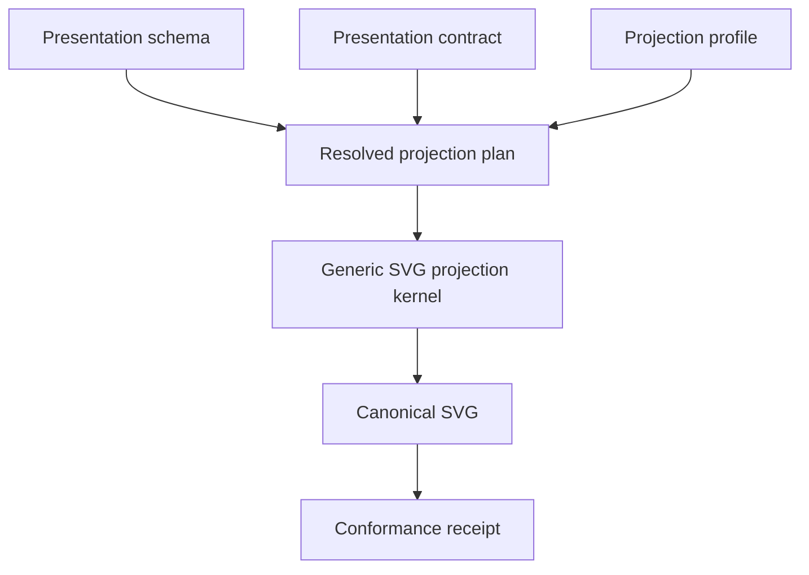

# Project deterministic SVG from presentation authority Contract

## Status

```text
CONTRACT STATUS: REVIEWED
CONTRACT TYPE: reviewed-capability-request.v1
SCHEMA VERSION: 1.0.0
DECLARED IMPLEMENTATION ARTIFACTS: 14
DECLARED RUNTIME OUTPUTS: 2
```

## Future-state preview



## Reviewed intent

Actor: reviewer of governed visual artifacts
Trigger: one pinned presentation schema, presentation contract, and SVG projection profile are submitted
Need: project the declared visual subject through one generic deterministic SVG interpreter
Purpose: produce byte-stable SVG and independently verifiable conformance evidence without renderer discretion

## Governed constraints

```json
{
  "constraints": [
    {
      "statementId": "schema-defines-language",
      "text": "The presentation schema alone defines which presentation declarations are legal."
    },
    {
      "statementId": "contract-defines-subject",
      "text": "The presentation contract alone defines sections, text, order, bounds, colors, fonts, icons, omission policy, and rewriting policy."
    },
    {
      "statementId": "profile-defines-rendering",
      "text": "The projection profile identifies the renderer catalog, theme catalog, primitive catalog, icon catalog, output path, and serialization policy."
    },
    {
      "statementId": "context-paths-are-resolved",
      "text": "The CLI receives one context JSON path and resolves schema.schemaPath, contract.contractPath, projection.profilePath, and projection.outputPath relative to the context file directory."
    },
    {
      "statementId": "referenced-bytes-are-required",
      "text": "Every referenced schema, contract, and profile file must exist, parse as JSON, and be consumed; missing or invalid referenced bytes are terminal RED and no default authority is permitted."
    },
    {
      "statementId": "input-hashes-use-exact-bytes",
      "text": "Schema, contract, and profile hashes are SHA-256 identities of the exact referenced file bytes, not reconstructed or reserialized JSON."
    },
    {
      "statementId": "contract-is-schema-validated",
      "text": "The parsed presentation contract must validate against the parsed referenced presentation schema before a projection plan is resolved."
    },
    {
      "statementId": "resolved-plan-is-persisted",
      "text": "The complete resolved projection plan is serialized deterministically to generated/resolved-projection-plan.json and its hash is computed from those exact bytes."
    },
    {
      "statementId": "no-fallback-presentation",
      "text": "Fallback canvas sizes, fallback operations, fallback artifact identities, hard-coded SVG content, and unconditional PASS observations are forbidden."
    },
    {
      "statementId": "kernel-is-generic",
      "text": "The SVG projection kernel contains no infographic-specific branching and makes no visual design decisions."
    },
    {
      "statementId": "primitives-are-closed",
      "text": "The primitive catalog is closed to create-svg-root, create-group, create-rectangle, create-line, create-path, create-text, create-tspan, create-icon, apply-transform, apply-style-token, bind-content, clip-region, and serialize-svg."
    },
    {
      "statementId": "renderers-are-closed",
      "text": "The initial renderer catalog is closed to split-hero, three-equal-cards, three-equal-columns, split-callout-with-center-divider, three-step-horizontal-journey, capability-equation, horizontal-banner, right-outcome-callout, and single-line-footer."
    },
    {
      "statementId": "icons-are-declarative",
      "text": "Every icon resolves from a pinned registry to declared viewBox and path data; external assets and substitutions are forbidden."
    },
    {
      "statementId": "serialization-is-canonical",
      "text": "SVG serialization uses UTF-8, LF endings, canonical attribute order, projection-sequence element order, fixed numeric precision, no timestamps, no random identifiers, no runtime comments, stable whitespace, and one terminal newline."
    },
    {
      "statementId": "inspection-is-independent",
      "text": "Conformance inspection parses emitted SVG bytes and compares observed structure with authority without trusting projector claims."
    },
    {
      "statementId": "evaluation-is-fail-closed",
      "text": "The acceptance algorithm evaluates ordered checks and returns the first assigned RED code; GREEN is forbidden when any required check fails."
    },
    {
      "statementId": "projection-is-capability-local",
      "text": "All implementation artifacts project beneath capabilities/project-deterministic-svg-from-presentation-authority using canonical scenario and responsibility folders."
    }
  ]
}
```

## Required outcome

One admitted presentation authority produces one canonical SVG artifact and one terminal conformance receipt.

```json
{
  "outcomeId": "governed-svg-projection-exists",
  "observableState": [
    {
      "statementId": "contract-consumed",
      "text": "The exact submitted presentation contract is validated and consumed."
    },
    {
      "statementId": "plan-is-resolved",
      "text": "One complete ordered projection plan resolves every section, bound, binding, token, icon, renderer, and proof requirement."
    },
    {
      "statementId": "svg-is-byte-stable",
      "text": "Repeated projection from identical authority produces byte-identical SVG."
    },
    {
      "statementId": "receipt-binds-evidence",
      "text": "The receipt binds schema, contract, profile, plan, and SVG hashes to the terminal disposition."
    },
    {
      "statementId": "negative-controls-are-specific",
      "text": "Every invalid authority or artifact condition returns its assigned first RED code."
    }
  ]
}
```

## User story

```text
As a reviewer of governed visual artifacts
I want a presentation schema, presentation contract, and projection profile to drive one generic SVG projection kernel
So that the declared visual subject is embodied and independently verified without renderer discretion or byte drift
```

Governing obligation: Transform only admitted presentation authority into canonical SVG bytes and a conformance receipt without infographic-specific branching or undeclared visual decisions.

## Acceptance Gherkin

```gherkin
Feature: Project deterministic SVG from presentation authority
  As a reviewer of governed visual artifacts
  I want a presentation schema, presentation contract, and projection profile to drive one generic SVG projection kernel
  So that the declared visual subject is embodied and independently verified without renderer discretion or byte drift

  Background:
    Given one immutable presentation schema identifies the admissible presentation language
    And one immutable presentation contract identifies the exact visual subject
    And one immutable projection profile identifies rendering and serialization policy
    And the renderer, theme, primitive, and icon registries are pinned and available

  @scenario-id:resolve-svg-projection-authority
  Scenario: Resolve admitted presentation authority
    Given the pinned schema, contract, profile, and registries are available as exact bytes
    And one context JSON path identifies all referenced authority files and the SVG output path
    When the resolver reads the context, resolves each referenced path relative to it, hashes exact bytes, validates the contract against the schema, and resolves layouts, content bindings, and proof requirements
    Then one ambiguity-free ordered SVG projection plan is returned
    And any missing, unknown, inconsistent, or unresolvable declaration is rejected before projection
    And no fallback canvas, operation, identity, content, or profile is introduced

  @scenario-id:execute-resolved-svg-projection
  Scenario: Execute the resolved plan without visual discretion
    Given one validated projection plan contains exact operations, bounds, bindings, tokens, and renderer identities
    When the generic projection kernel executes every operation in declared sequence
    Then each emitted SVG element corresponds to one admitted operation
    And no artifact-specific branch, external asset, substitution, or inferred design decision is introduced

  @scenario-id:serialize-svg-canonically
  Scenario: Serialize one byte-stable SVG artifact
    Given one complete in-memory SVG tree contains only admitted elements and attributes
    When the canonical serializer orders and encodes the tree under the pinned policy
    Then identical authority produces byte-identical UTF-8 SVG with LF endings and one terminal newline
    And timestamps, random identifiers, runtime comments, and unstable whitespace are absent

  @scenario-id:inspect-generated-svg
  Scenario: Inspect the emitted artifact independently
    Given the exact emitted SVG bytes and admitted presentation authority are available
    When the inspector parses the SVG and evaluates identities, order, bounds, text, tokens, icons, overflow, and undeclared elements
    Then one ordered observation exists for every proof requirement
    And observed SVG state is compared with authority without trusting projector claims

  @scenario-id:project-svg-conformance-receipt
  Scenario: Issue the terminal conformance receipt
    Given all ordered proof observations and exact input, plan, and SVG hashes are available
    When the evaluator applies the fail-closed acceptance algorithm
    Then INFOGRAPHIC_CONFORMS is issued only when every required check passes
    And the first failed check returns its assigned terminal RED code and no GREEN receipt
```

## Canonical authority graph

```text
1. scenario/resolve-svg-projection-authority
   -> obligation/resolve-all-presentation-decisions
   -> responsibility/resolve-svg-projection-authority
   -> semantic-operation/resolve-svg-projection-authority
   -> signal/svg-projection-authority-resolved
   -> expectation/resolved-authority-expected
   -> disposition/PROJECTION_AUTHORITY_RESOLVED
2. scenario/execute-resolved-svg-projection
   -> obligation/interpret-plan-mechanically
   -> responsibility/execute-resolved-svg-projection
   -> semantic-operation/execute-resolved-svg-projection
   -> signal/resolved-svg-projection-executed
   -> expectation/projection-execution-expected
   -> disposition/SVG_ELEMENTS_PROJECTED
3. scenario/serialize-svg-canonically
   -> obligation/emit-canonical-svg-bytes
   -> responsibility/serialize-svg-canonically
   -> semantic-operation/serialize-svg-canonically
   -> signal/canonical-svg-serialized
   -> expectation/canonical-svg-expected
   -> disposition/SVG_BYTES_CANONICAL
4. scenario/inspect-generated-svg
   -> obligation/inspect-svg-independently
   -> responsibility/inspect-generated-svg
   -> semantic-operation/inspect-generated-svg
   -> signal/generated-svg-inspected
   -> expectation/inspection-expected
   -> disposition/SVG_OBSERVATIONS_COMPLETE
5. scenario/project-svg-conformance-receipt
   -> obligation/bind-terminal-evidence
   -> responsibility/project-svg-conformance-receipt
   -> semantic-operation/project-svg-conformance-receipt
   -> signal/svg-conformance-receipt-projected
   -> expectation/receipt-expected
   -> disposition/INFOGRAPHIC_CONFORMS
```

## Scenario authority

### resolve-svg-projection-authority

```json
{
  "obligation": {
    "obligationId": "resolve-all-presentation-decisions",
    "statement": "Resolve all presentation decisions before SVG element creation."
  },
  "responsibility": {
    "responsibilityId": "resolve-svg-projection-authority",
    "kind": "composition",
    "semanticOperationId": "resolve-svg-projection-authority"
  },
  "signal": {
    "signalId": "svg-projection-authority-resolved",
    "statement": "One complete resolved projection plan is observable.",
    "resultShape": {
      "contractId": "resolved-svg-presentation.v1",
      "fields": [
        {
          "name": "projectionPlanType",
          "type": "string",
          "required": true
        },
        {
          "name": "artifactId",
          "type": "string",
          "required": true
        },
        {
          "name": "canvas",
          "type": "object",
          "required": true
        },
        {
          "name": "operations",
          "type": "array",
          "required": true
        },
        {
          "name": "proofRequirementId",
          "type": "string",
          "required": true
        }
      ]
    }
  },
  "expectation": {
    "expectationId": "resolved-authority-expected",
    "signalId": "svg-projection-authority-resolved",
    "expectedDisposition": "PROJECTION_AUTHORITY_RESOLVED"
  }
}
```

### execute-resolved-svg-projection

```json
{
  "obligation": {
    "obligationId": "interpret-plan-mechanically",
    "statement": "Mechanically interpret the resolved plan through bounded generic primitives and renderers."
  },
  "responsibility": {
    "responsibilityId": "execute-resolved-svg-projection",
    "kind": "execution",
    "semanticOperationId": "execute-resolved-svg-projection"
  },
  "signal": {
    "signalId": "resolved-svg-projection-executed",
    "statement": "The complete admitted SVG element tree is observable.",
    "resultShape": {
      "contractId": "svg-projection-execution.v1",
      "fields": [
        {
          "name": "artifactId",
          "type": "string",
          "required": true
        },
        {
          "name": "svgTree",
          "type": "object",
          "required": true
        },
        {
          "name": "operationCount",
          "type": "integer",
          "required": true
        },
        {
          "name": "projectedOperationCount",
          "type": "integer",
          "required": true
        }
      ]
    }
  },
  "expectation": {
    "expectationId": "projection-execution-expected",
    "signalId": "resolved-svg-projection-executed",
    "expectedDisposition": "SVG_ELEMENTS_PROJECTED"
  }
}
```

### serialize-svg-canonically

```json
{
  "obligation": {
    "obligationId": "emit-canonical-svg-bytes",
    "statement": "Emit canonical SVG bytes whose identity depends only on admitted authority."
  },
  "responsibility": {
    "responsibilityId": "serialize-svg-canonically",
    "kind": "projection",
    "semanticOperationId": "serialize-svg-canonically"
  },
  "signal": {
    "signalId": "canonical-svg-serialized",
    "statement": "Exact canonical SVG bytes and their hash are observable.",
    "resultShape": {
      "contractId": "canonical-svg-artifact.v1",
      "fields": [
        {
          "name": "artifactId",
          "type": "string",
          "required": true
        },
        {
          "name": "outputPath",
          "type": "string",
          "required": true
        },
        {
          "name": "svgSha256",
          "type": "string",
          "required": true
        },
        {
          "name": "byteLength",
          "type": "integer",
          "required": true
        }
      ]
    }
  },
  "expectation": {
    "expectationId": "canonical-svg-expected",
    "signalId": "canonical-svg-serialized",
    "expectedDisposition": "SVG_BYTES_CANONICAL"
  }
}
```

### inspect-generated-svg

```json
{
  "obligation": {
    "obligationId": "inspect-svg-independently",
    "statement": "Observe generated SVG structure and presentation semantics independently of projection execution."
  },
  "responsibility": {
    "responsibilityId": "inspect-generated-svg",
    "kind": "observation",
    "semanticOperationId": "inspect-generated-svg"
  },
  "signal": {
    "signalId": "generated-svg-inspected",
    "statement": "Complete ordered proof observations are observable.",
    "resultShape": {
      "contractId": "svg-conformance-observation.v1",
      "fields": [
        {
          "name": "artifactId",
          "type": "string",
          "required": true
        },
        {
          "name": "observations",
          "type": "array",
          "required": true
        },
        {
          "name": "findingCount",
          "type": "integer",
          "required": true
        },
        {
          "name": "findings",
          "type": "array",
          "required": true
        }
      ]
    }
  },
  "expectation": {
    "expectationId": "inspection-expected",
    "signalId": "generated-svg-inspected",
    "expectedDisposition": "SVG_OBSERVATIONS_COMPLETE"
  }
}
```

### project-svg-conformance-receipt

```json
{
  "obligation": {
    "obligationId": "bind-terminal-evidence",
    "statement": "Bind exact authority and artifact identities to one exhaustive terminal disposition."
  },
  "responsibility": {
    "responsibilityId": "project-svg-conformance-receipt",
    "kind": "conformance",
    "semanticOperationId": "project-svg-conformance-receipt"
  },
  "signal": {
    "signalId": "svg-conformance-receipt-projected",
    "statement": "One terminal receipt binding all required hashes and findings is observable.",
    "resultShape": {
      "contractId": "deterministic-infographic-projection-receipt.v1",
      "fields": [
        {
          "name": "receiptType",
          "type": "string",
          "required": true
        },
        {
          "name": "artifactId",
          "type": "string",
          "required": true
        },
        {
          "name": "schemaId",
          "type": "string",
          "required": true
        },
        {
          "name": "schemaHash",
          "type": "string",
          "required": true
        },
        {
          "name": "contractHash",
          "type": "string",
          "required": true
        },
        {
          "name": "rendererProfileId",
          "type": "string",
          "required": true
        },
        {
          "name": "projectionPlanHash",
          "type": "string",
          "required": true
        },
        {
          "name": "svgHash",
          "type": "string",
          "required": true
        },
        {
          "name": "sectionCount",
          "type": "integer",
          "required": true
        },
        {
          "name": "projectedSectionCount",
          "type": "integer",
          "required": true
        },
        {
          "name": "findings",
          "type": "array",
          "required": true
        },
        {
          "name": "disposition",
          "type": "string",
          "allowedValues": [
            "INFOGRAPHIC_CONFORMS"
          ],
          "required": true
        }
      ]
    }
  },
  "expectation": {
    "expectationId": "receipt-expected",
    "signalId": "svg-conformance-receipt-projected",
    "expectedDisposition": "INFOGRAPHIC_CONFORMS"
  }
}
```

## Implementation projection

```json
{
  "profileId": "canonical-capability-artifact-projection.v1",
  "capabilityRoot": "capabilities/project-deterministic-svg-from-presentation-authority",
  "dependencyPolicy": {
    "policyId": "self-contained-capability.v1",
    "importsOutsideCapabilityRoot": false,
    "allowedRuntimeImports": [
      "node:crypto",
      "node:fs",
      "node:path",
      "node:url"
    ]
  },
  "entrypoints": [
    {
      "entrypointId": "runtime",
      "artifactId": "runtime-projector"
    },
    {
      "entrypointId": "verification",
      "artifactId": "standalone-verifier"
    }
  ],
  "runtimeOutputs": [
    {
      "outputId": "resolved-projection-plan",
      "path": "generated/resolved-projection-plan.json",
      "mediaType": "application/json",
      "producedByScenarioId": "resolve-svg-projection-authority",
      "expectedByteSha256": "sha256:041018be61555502df2230815cfe8ac04b2b545f37aa6ffea568126b82077b07"
    },
    {
      "outputId": "canonical-svg",
      "path": "generated/governed-svg-review.svg",
      "mediaType": "image/svg+xml",
      "producedByScenarioId": "serialize-svg-canonically",
      "expectedByteSha256": "sha256:45d38950c0b6ba5acbdf97cea8cf7d4f7cfb2ff1edf0d8996cafe7709f0f1c03"
    }
  ]
}
```

### package.json

```json
{
  "artifactId": "package-manifest",
  "role": "package-manifest",
  "mediaType": "application/json",
  "projectionType": "canonical-json-value.v1",
  "serialization": {
    "encoding": "UTF-8",
    "keyOrder": "lexicographic",
    "indentSpaces": 2,
    "lineEnding": "LF",
    "terminalNewline": true
  },
  "byteSha256": "sha256:d4971a02d6ce76711c2ad6c34c3b77059d8c726d8e380d701672d6e636ad2b57"
}
```

```json
{
  "bin": {
    "project-svg": "./runtime/projects-svg-from-presentation-authority.mjs"
  },
  "name": "project-deterministic-svg-from-presentation-authority",
  "scripts": {
    "start": "node runtime/projects-svg-from-presentation-authority.mjs",
    "verify": "node verification/verifies-standalone-projection.mjs"
  },
  "type": "module",
  "version": "1.0.0"
}
```

### authority/presentation.schema.json

```json
{
  "artifactId": "presentation-schema",
  "role": "authority",
  "mediaType": "application/json",
  "projectionType": "canonical-json-value.v1",
  "serialization": {
    "encoding": "UTF-8",
    "keyOrder": "lexicographic",
    "indentSpaces": 2,
    "lineEnding": "LF",
    "terminalNewline": true
  },
  "byteSha256": "sha256:a149d9dc5cd155a0cd9d50024be04c6efd6e0b8e75b3a727835d605ecbdfdf5a"
}
```

```json
{
  "$id": "https://canonical-feature-authority/schemas/deterministic-infographic-presentation.v1.schema.json",
  "$schema": "https://json-schema.org/draft/2020-12/schema",
  "additionalProperties": false,
  "properties": {
    "artifactId": {
      "pattern": "^[a-z][a-z0-9-]*$",
      "type": "string"
    },
    "authorityType": {
      "const": "deterministic-infographic-presentation.v1"
    },
    "canvas": {
      "additionalProperties": false,
      "properties": {
        "height": {
          "minimum": 1,
          "type": "integer"
        },
        "viewBox": {
          "type": "string"
        },
        "width": {
          "minimum": 1,
          "type": "integer"
        }
      },
      "required": [
        "width",
        "height",
        "viewBox"
      ],
      "type": "object"
    },
    "proofRequirementId": {
      "pattern": "^[a-z][a-z0-9-]*\\.v[1-9][0-9]*$",
      "type": "string"
    },
    "sections": {
      "items": {
        "additionalProperties": false,
        "properties": {
          "bounds": {
            "additionalProperties": false,
            "properties": {
              "height": {
                "exclusiveMinimum": 0,
                "type": "number"
              },
              "width": {
                "exclusiveMinimum": 0,
                "type": "number"
              },
              "x": {
                "type": "number"
              },
              "y": {
                "type": "number"
              }
            },
            "required": [
              "x",
              "y",
              "width",
              "height"
            ],
            "type": "object"
          },
          "rendererId": {
            "pattern": "^[a-z][a-z0-9-]*$",
            "type": "string"
          },
          "sectionId": {
            "pattern": "^[a-z][a-z0-9-]*$",
            "type": "string"
          },
          "styleToken": {
            "pattern": "^[a-z][a-z0-9-]*$",
            "type": "string"
          },
          "text": {
            "minLength": 1,
            "type": "string"
          }
        },
        "required": [
          "sectionId",
          "rendererId",
          "bounds",
          "text",
          "styleToken"
        ],
        "type": "object"
      },
      "minItems": 1,
      "type": "array"
    }
  },
  "required": [
    "authorityType",
    "artifactId",
    "canvas",
    "sections",
    "proofRequirementId"
  ],
  "type": "object"
}
```

### authority/projection.profile.json

```json
{
  "artifactId": "projection-profile",
  "role": "authority",
  "mediaType": "application/json",
  "projectionType": "canonical-json-value.v1",
  "serialization": {
    "encoding": "UTF-8",
    "keyOrder": "lexicographic",
    "indentSpaces": 2,
    "lineEnding": "LF",
    "terminalNewline": true
  },
  "byteSha256": "sha256:1c9044dbe84774286737b4d0f5be941e53ede72a163fb9788d7c08aaef2a2b69"
}
```

```json
{
  "profileId": "deterministic-editorial-svg",
  "profileType": "deterministic-editorial-svg.v1",
  "renderers": {
    "horizontal-banner": {
      "rendererType": "rectangle-with-centered-text.v1"
    }
  },
  "serializationPolicy": {
    "attributeOrder": "alphabetical",
    "elementOrder": "projection-sequence",
    "encoding": "UTF-8",
    "lineEnding": "LF",
    "numericPrecision": 2,
    "randomIdentifiers": "forbidden",
    "terminalNewline": true,
    "timestamps": "forbidden"
  },
  "styleTokens": {
    "review-banner": {
      "fill": "#F7F9FC",
      "fontFamily": "Arial",
      "fontSize": 20,
      "textFill": "#111827"
    }
  }
}
```

### examples/context.json

```json
{
  "artifactId": "example-context",
  "role": "fixture",
  "mediaType": "application/json",
  "projectionType": "canonical-json-value.v1",
  "serialization": {
    "encoding": "UTF-8",
    "keyOrder": "lexicographic",
    "indentSpaces": 2,
    "lineEnding": "LF",
    "terminalNewline": true
  },
  "byteSha256": "sha256:98cba2b4b8cc82e2b4acda7e14578be4ebcd7bd805359edd2a0be64f562e1bcd"
}
```

```json
{
  "contract": {
    "contractPath": "presentation.contract.json"
  },
  "projection": {
    "outputPath": "../generated/governed-svg-review.svg",
    "profileId": "deterministic-editorial-svg",
    "profilePath": "../authority/projection.profile.json"
  },
  "schema": {
    "schemaId": "deterministic-infographic-authority.v1",
    "schemaPath": "../authority/presentation.schema.json"
  }
}
```

### examples/presentation.contract.json

```json
{
  "artifactId": "example-presentation-contract",
  "role": "fixture",
  "mediaType": "application/json",
  "projectionType": "canonical-json-value.v1",
  "serialization": {
    "encoding": "UTF-8",
    "keyOrder": "lexicographic",
    "indentSpaces": 2,
    "lineEnding": "LF",
    "terminalNewline": true
  },
  "byteSha256": "sha256:e68e9ca3ca967c014089e99562d556f8cfa33add1009effe7263f62f471e203b"
}
```

```json
{
  "artifactId": "governed-svg-review",
  "authorityType": "deterministic-infographic-presentation.v1",
  "canvas": {
    "height": 120,
    "viewBox": "0 0 200 120",
    "width": 200
  },
  "proofRequirementId": "deterministic-infographic-svg-proof.v1",
  "sections": [
    {
      "bounds": {
        "height": 80,
        "width": 180,
        "x": 10,
        "y": 20
      },
      "rendererId": "horizontal-banner",
      "sectionId": "review-banner",
      "styleToken": "review-banner",
      "text": "Governed SVG"
    }
  ]
}
```

### examples/expected-governed-svg-review.svg

```json
{
  "artifactId": "expected-svg",
  "role": "expected-output",
  "mediaType": "image/svg+xml",
  "projectionType": "utf8-text.v1",
  "serialization": {
    "encoding": "UTF-8",
    "lineEnding": "LF",
    "terminalNewline": true
  },
  "byteSha256": "sha256:45d38950c0b6ba5acbdf97cea8cf7d4f7cfb2ff1edf0d8996cafe7709f0f1c03"
}
```

```xml
<svg height="120" viewBox="0 0 200 120" width="200" xmlns="http://www.w3.org/2000/svg">
  <g id="review-banner">
    <rect fill="#F7F9FC" height="80" width="180" x="10" y="20"/>
    <text fill="#111827" font-family="Arial" font-size="20" text-anchor="middle" x="100" y="66">Governed SVG</text>
  </g>
</svg>
```

### composition/projects-svg-from-presentation-authority.mjs

```json
{
  "artifactId": "capability-composition",
  "role": "composition",
  "mediaType": "text/javascript",
  "projectionType": "lossless-source-tokens.v1",
  "serialization": {
    "encoding": "UTF-8",
    "assembly": "token-sequence",
    "lineEnding": "LF"
  },
  "byteSha256": "sha256:f78225a431ef92f99bac8bdd99476eb82528753e983e8bb9b707f6de27c4c9c6"
}
```

```javascript
// @generated
// feature-id: project-deterministic-svg-from-presentation-authority
import { resolveSvgProjectionAuthority } from "../scenarios/resolve-svg-projection-authority/resolve-svg-projection-authority/resolve-svg-projection-authority.mjs";
import { executeResolvedSvgProjection } from "../scenarios/execute-resolved-svg-projection/execute-resolved-svg-projection/execute-resolved-svg-projection.mjs";
import { serializeSvgCanonically } from "../scenarios/serialize-svg-canonically/serialize-svg-canonically/serialize-svg-canonically.mjs";
import { inspectGeneratedSvg } from "../scenarios/inspect-generated-svg/inspect-generated-svg/inspect-generated-svg.mjs";
import { projectSvgConformanceReceipt } from "../scenarios/project-svg-conformance-receipt/project-svg-conformance-receipt/project-svg-conformance-receipt.mjs";

export function projectsSvgFromPresentationAuthority(contextPath) {
  const authority = resolveSvgProjectionAuthority(contextPath);
  const execution = executeResolvedSvgProjection(authority);
  const serialized = serializeSvgCanonically(execution, authority.outputPath);
  const inspection = inspectGeneratedSvg(serialized, authority, execution);
  return projectSvgConformanceReceipt(authority, execution, serialized, inspection);
}
```

### runtime/projects-svg-from-presentation-authority.mjs

```json
{
  "artifactId": "runtime-projector",
  "role": "runtime",
  "mediaType": "text/javascript",
  "projectionType": "lossless-source-tokens.v1",
  "serialization": {
    "encoding": "UTF-8",
    "assembly": "token-sequence",
    "lineEnding": "LF"
  },
  "byteSha256": "sha256:0ff68c8e67eeab3265a54269be27ce084cd7432ea117567de880d299a9a0cf4b"
}
```

```javascript
#!/usr/bin/env node
// @generated
// feature-id: project-deterministic-svg-from-presentation-authority
import { resolve } from "node:path";
import { fileURLToPath } from "node:url";
import { projectsSvgFromPresentationAuthority } from "../composition/projects-svg-from-presentation-authority.mjs";

const capabilityRoot = resolve(fileURLToPath(new URL("..", import.meta.url)));
const contextPath = resolve(process.argv[2] ?? resolve(capabilityRoot, "examples/context.json"));
try {
  const receipt = projectsSvgFromPresentationAuthority(contextPath);
  process.stdout.write(JSON.stringify(receipt) + "\n");
  if (receipt.disposition !== "INFOGRAPHIC_CONFORMS") process.exitCode = 1;
} catch (error) {
  process.stderr.write((error instanceof Error ? error.message : String(error)) + "\n");
  process.exitCode = 1;
}
```

### scenarios/resolve-svg-projection-authority/resolve-svg-projection-authority/resolve-svg-projection-authority.mjs

```json
{
  "artifactId": "resolve-authority-responsibility",
  "role": "scenario-responsibility",
  "mediaType": "text/javascript",
  "scenarioBinding": {
    "scenarioId": "resolve-svg-projection-authority",
    "responsibilityId": "resolve-svg-projection-authority"
  },
  "projectionType": "lossless-source-tokens.v1",
  "serialization": {
    "encoding": "UTF-8",
    "assembly": "token-sequence",
    "lineEnding": "LF"
  },
  "byteSha256": "sha256:b3330ccee055e1e77a9cf2908d6a0066827013f032d75aee429375fe38528aec"
}
```

```javascript
// @generated
// feature-id: project-deterministic-svg-from-presentation-authority
import { createHash } from "node:crypto";
import { readFileSync, writeFileSync, mkdirSync } from "node:fs";
import { dirname, resolve } from "node:path";

function hash(bytes) {
  return "sha256:" + createHash("sha256").update(bytes).digest("hex");
}

function readJson(path, code) {
  let bytes;
  try { bytes = readFileSync(path); } catch { throw new Error(code + "_MISSING"); }
  try { return {bytes, value: JSON.parse(bytes.toString("utf8"))}; }
  catch { throw new Error(code + "_JSON_INVALID"); }
}

function exactKeys(value, keys) {
  return value && typeof value === "object" && !Array.isArray(value) &&
    Object.keys(value).sort().join("|") === [...keys].sort().join("|");
}

function validateContract(value) {
  if (!exactKeys(value, ["authorityType", "artifactId", "canvas", "sections", "proofRequirementId"])) return false;
  if (value.authorityType !== "deterministic-infographic-presentation.v1") return false;
  if (!exactKeys(value.canvas, ["width", "height", "viewBox"])) return false;
  if (!Number.isInteger(value.canvas.width) || value.canvas.width < 1) return false;
  if (!Number.isInteger(value.canvas.height) || value.canvas.height < 1) return false;
  if (!Array.isArray(value.sections) || value.sections.length < 1) return false;
  return value.sections.every(section =>
    exactKeys(section, ["sectionId", "rendererId", "bounds", "text", "styleToken"]) &&
    exactKeys(section.bounds, ["x", "y", "width", "height"]) &&
    section.bounds.width > 0 && section.bounds.height > 0 &&
    typeof section.text === "string" && section.text.length > 0
  );
}

export function resolveSvgProjectionAuthority(contextPath) {
  const absoluteContext = resolve(contextPath);
  const contextDirectory = dirname(absoluteContext);
  const contextRecord = readJson(absoluteContext, "CONTEXT");
  const context = contextRecord.value;
  if (!context.schema?.schemaPath || !context.contract?.contractPath ||
      !context.projection?.profilePath || !context.projection?.outputPath) {
    throw new Error("CONTEXT_PATHS_INCOMPLETE");
  }
  const schemaRecord = readJson(resolve(contextDirectory, context.schema.schemaPath), "SCHEMA");
  const contractRecord = readJson(resolve(contextDirectory, context.contract.contractPath), "CONTRACT");
  const profileRecord = readJson(resolve(contextDirectory, context.projection.profilePath), "PROFILE");
  if (!validateContract(contractRecord.value)) throw new Error("PRESENTATION_CONTRACT_SCHEMA_INVALID");
  const contract = contractRecord.value;
  const profile = profileRecord.value;
  if (profile.profileId !== context.projection.profileId) throw new Error("PROJECTION_PROFILE_IDENTITY_MISMATCH");
  const operations = [];
  contract.sections.forEach((section, index) => {
    const renderer = profile.renderers?.[section.rendererId];
    const style = profile.styleTokens?.[section.styleToken];
    if (renderer?.rendererType !== "rectangle-with-centered-text.v1") throw new Error("RENDERER_UNRESOLVED");
    if (!style) throw new Error("STYLE_TOKEN_UNRESOLVED");
    operations.push({
      sequence: index + 1,
      operation: "render-rectangle-with-centered-text",
      sectionId: section.sectionId,
      bounds: section.bounds,
      text: section.text,
      style
    });
  });
  const plan = {
    projectionPlanType: "resolved-svg-presentation.v1",
    artifactId: contract.artifactId,
    canvas: contract.canvas,
    operations,
    proofRequirementId: contract.proofRequirementId
  };
  const planBytes = Buffer.from(JSON.stringify(plan, null, 2) + "\n", "utf8");
  const planPath = resolve(contextDirectory, "../generated/resolved-projection-plan.json");
  mkdirSync(dirname(planPath), {recursive: true});
  writeFileSync(planPath, planBytes);
  return {
    schemaId: context.schema.schemaId,
    schemaHash: hash(schemaRecord.bytes),
    contractHash: hash(contractRecord.bytes),
    rendererProfileId: profile.profileId,
    projectionPlanHash: hash(planBytes),
    outputPath: resolve(contextDirectory, context.projection.outputPath),
    contract,
    plan
  };
}
```

### scenarios/execute-resolved-svg-projection/execute-resolved-svg-projection/execute-resolved-svg-projection.mjs

```json
{
  "artifactId": "execute-projection-responsibility",
  "role": "scenario-responsibility",
  "mediaType": "text/javascript",
  "scenarioBinding": {
    "scenarioId": "execute-resolved-svg-projection",
    "responsibilityId": "execute-resolved-svg-projection"
  },
  "projectionType": "lossless-source-tokens.v1",
  "serialization": {
    "encoding": "UTF-8",
    "assembly": "token-sequence",
    "lineEnding": "LF"
  },
  "byteSha256": "sha256:fe40ef6117bab3dbf1a60c68d7b9c81f57c981ee40538198d3887f47d2a5d012"
}
```

```javascript
// @generated
// feature-id: project-deterministic-svg-from-presentation-authority
export function executeResolvedSvgProjection(authority) {
  const canvas = authority.plan.canvas;
  const root = {
    tag: "svg",
    attributes: {
      height: canvas.height,
      viewBox: canvas.viewBox,
      width: canvas.width,
      xmlns: "http://www.w3.org/2000/svg"
    },
    children: []
  };
  for (const operation of authority.plan.operations) {
    if (operation.operation !== "render-rectangle-with-centered-text") {
      throw new Error("PROJECTION_OPERATION_UNRESOLVED");
    }
    const {bounds, style} = operation;
    root.children.push({
      tag: "g",
      attributes: {id: operation.sectionId},
      children: [
        {
          tag: "rect",
          attributes: {
            fill: style.fill,
            height: bounds.height,
            width: bounds.width,
            x: bounds.x,
            y: bounds.y
          },
          children: []
        },
        {
          tag: "text",
          attributes: {
            fill: style.textFill,
            "font-family": style.fontFamily,
            "font-size": style.fontSize,
            "text-anchor": "middle",
            x: bounds.x + bounds.width / 2,
            y: bounds.y + bounds.height / 2 + style.fontSize * 0.3
          },
          text: operation.text,
          children: []
        }
      ]
    });
  }
  return {
    artifactId: authority.plan.artifactId,
    svgTree: root,
    operationCount: authority.plan.operations.length,
    projectedOperationCount: authority.plan.operations.length
  };
}
```

### scenarios/serialize-svg-canonically/serialize-svg-canonically/serialize-svg-canonically.mjs

```json
{
  "artifactId": "serialize-svg-responsibility",
  "role": "scenario-responsibility",
  "mediaType": "text/javascript",
  "scenarioBinding": {
    "scenarioId": "serialize-svg-canonically",
    "responsibilityId": "serialize-svg-canonically"
  },
  "projectionType": "lossless-source-tokens.v1",
  "serialization": {
    "encoding": "UTF-8",
    "assembly": "token-sequence",
    "lineEnding": "LF"
  },
  "byteSha256": "sha256:69482f3f05b71f49f3c54a9790a508633bb18da61905a42d8285f9f2a50d8b58"
}
```

```javascript
// @generated
// feature-id: project-deterministic-svg-from-presentation-authority
import { createHash } from "node:crypto";
import { mkdirSync, writeFileSync } from "node:fs";
import { dirname } from "node:path";

function escape(value) {
  return String(value).replaceAll("&", "&amp;").replaceAll('"', "&quot;")
    .replaceAll("<", "&lt;").replaceAll(">", "&gt;");
}

function render(node, depth = 0) {
  const indent = "  ".repeat(depth);
  const attributes = Object.entries(node.attributes ?? {}).sort(([a], [b]) => a.localeCompare(b))
    .map(([key, value]) => key + '="' + escape(value) + '"').join(" ");
  const open = "<" + node.tag + (attributes ? " " + attributes : "");
  if ((node.children?.length ?? 0) === 0 && node.text === undefined) return indent + open + "/>";
  if ((node.children?.length ?? 0) === 0) return indent + open + ">" + escape(node.text) + "</" + node.tag + ">";
  return indent + open + ">\n" + node.children.map(child => render(child, depth + 1)).join("\n") +
    "\n" + indent + "</" + node.tag + ">";
}

export function serializeSvgCanonically(execution, outputPath) {
  const bytes = Buffer.from(render(execution.svgTree) + "\n", "utf8");
  mkdirSync(dirname(outputPath), {recursive: true});
  writeFileSync(outputPath, bytes);
  return {
    artifactId: execution.artifactId,
    outputPath,
    svgHash: "sha256:" + createHash("sha256").update(bytes).digest("hex"),
    byteLength: bytes.length,
    svgText: bytes.toString("utf8")
  };
}
```

### scenarios/inspect-generated-svg/inspect-generated-svg/inspect-generated-svg.mjs

```json
{
  "artifactId": "inspect-svg-responsibility",
  "role": "scenario-responsibility",
  "mediaType": "text/javascript",
  "scenarioBinding": {
    "scenarioId": "inspect-generated-svg",
    "responsibilityId": "inspect-generated-svg"
  },
  "projectionType": "lossless-source-tokens.v1",
  "serialization": {
    "encoding": "UTF-8",
    "assembly": "token-sequence",
    "lineEnding": "LF"
  },
  "byteSha256": "sha256:4aa1c4a70d3436c6c174e7610dc42d32406ccd31bc428805b00ab416a660966e"
}
```

```javascript
// @generated
// feature-id: project-deterministic-svg-from-presentation-authority
export function inspectGeneratedSvg(serialized, authority, execution) {
  const findings = [];
  if (execution.operationCount !== authority.contract.sections.length) findings.push("SVG_SECTION_COVERAGE_MISMATCH");
  for (const section of authority.contract.sections) {
    if (!serialized.svgText.includes('id="' + section.sectionId + '"')) findings.push("SVG_SEMANTIC_IDENTITY_MISMATCH");
    if (!serialized.svgText.includes(">" + section.text + "</text>")) findings.push("SVG_TEXT_MISMATCH");
  }
  if (!serialized.svgText.endsWith("\n")) findings.push("SVG_TERMINAL_NEWLINE_MISSING");
  return {artifactId: execution.artifactId, findings, findingCount: findings.length};
}
```

### scenarios/project-svg-conformance-receipt/project-svg-conformance-receipt/project-svg-conformance-receipt.mjs

```json
{
  "artifactId": "project-receipt-responsibility",
  "role": "scenario-responsibility",
  "mediaType": "text/javascript",
  "scenarioBinding": {
    "scenarioId": "project-svg-conformance-receipt",
    "responsibilityId": "project-svg-conformance-receipt"
  },
  "projectionType": "lossless-source-tokens.v1",
  "serialization": {
    "encoding": "UTF-8",
    "assembly": "token-sequence",
    "lineEnding": "LF"
  },
  "byteSha256": "sha256:5695f03da81a0ac65bb8b90a241ac13306a5ead62bd84b1275475cc3e88b58f3"
}
```

```javascript
// @generated
// feature-id: project-deterministic-svg-from-presentation-authority
export function projectSvgConformanceReceipt(authority, execution, serialized, inspection) {
  return {
    receiptType: "deterministic-infographic-projection-receipt.v1",
    artifactId: execution.artifactId,
    schemaId: authority.schemaId,
    schemaHash: authority.schemaHash,
    contractHash: authority.contractHash,
    rendererProfileId: authority.rendererProfileId,
    projectionPlanHash: authority.projectionPlanHash,
    svgHash: serialized.svgHash,
    sectionCount: authority.contract.sections.length,
    projectedSectionCount: execution.projectedOperationCount,
    findings: inspection.findings,
    disposition: inspection.findings.length === 0 ? "INFOGRAPHIC_CONFORMS" : "INFOGRAPHIC_NON_CONFORMING"
  };
}
```

### verification/verifies-standalone-projection.mjs

```json
{
  "artifactId": "standalone-verifier",
  "role": "verification",
  "mediaType": "text/javascript",
  "projectionType": "lossless-source-tokens.v1",
  "serialization": {
    "encoding": "UTF-8",
    "assembly": "token-sequence",
    "lineEnding": "LF"
  },
  "byteSha256": "sha256:49323e7c31e5b079edac73d761d4e704ec791fe2ad3516c1a0d9aa4fdeb3f602"
}
```

```javascript
// @generated
import { createHash } from "node:crypto";
import { readFileSync } from "node:fs";
import { resolve } from "node:path";
import { fileURLToPath } from "node:url";
import { projectsSvgFromPresentationAuthority } from "../composition/projects-svg-from-presentation-authority.mjs";
const root = resolve(fileURLToPath(new URL("..", import.meta.url)));
const receipt = projectsSvgFromPresentationAuthority(resolve(root, "examples/context.json"));
const actual = readFileSync(resolve(root, "generated/governed-svg-review.svg"));
const expected = readFileSync(resolve(root, "examples/expected-governed-svg-review.svg"));
if (!actual.equals(expected)) throw new Error("STANDALONE_SVG_BYTES_DIVERGE");
if (receipt.disposition !== "INFOGRAPHIC_CONFORMS") throw new Error("STANDALONE_RECEIPT_RED");
const hash = "sha256:" + createHash("sha256").update(actual).digest("hex");
if (receipt.svgHash !== hash) throw new Error("STANDALONE_RECEIPT_HASH_DIVERGES");
process.stdout.write(JSON.stringify({disposition: "GREEN", svgHash: hash}) + "\n");
```

## Canonical file body system

```text
capabilities/project-deterministic-svg-from-presentation-authority/
  package.json
  authority/presentation.schema.json
  authority/projection.profile.json
  examples/context.json
  examples/presentation.contract.json
  examples/expected-governed-svg-review.svg
  composition/projects-svg-from-presentation-authority.mjs
  runtime/projects-svg-from-presentation-authority.mjs
  scenarios/resolve-svg-projection-authority/resolve-svg-projection-authority/resolve-svg-projection-authority.mjs
  scenarios/execute-resolved-svg-projection/execute-resolved-svg-projection/execute-resolved-svg-projection.mjs
  scenarios/serialize-svg-canonically/serialize-svg-canonically/serialize-svg-canonically.mjs
  scenarios/inspect-generated-svg/inspect-generated-svg/inspect-generated-svg.mjs
  scenarios/project-svg-conformance-receipt/project-svg-conformance-receipt/project-svg-conformance-receipt.mjs
  verification/verifies-standalone-projection.mjs
  generated/resolved-projection-plan.json [runtime output]
  generated/governed-svg-review.svg [runtime output]
```

## Implementation boundary

- `pure-projector-only`: Projection is performed by the generic deterministic capability projector directly from this schema-valid contract; no conveyor stage, runtime, adapter, model, or feature-specific projector participates.
- `contract-declares-all-artifacts`: Every materialized path, artifact role, scenario binding, entrypoint, dependency permission, projection form, source token, and expected byte hash is declared in this contract.
- `standalone-capability-boundary`: The projected capability may import Node.js runtime modules declared by dependency policy and relative files declared inside its own capability root, but no file outside that root.

## Implementation exit condition

- `clean-root-is-exact`: Projection into an empty root produces exactly the declared artifact set and every artifact matches its declared SHA-256 identity.
- `isolated-copy-runs`: A copy containing only the projected capability folder executes its declared verification entrypoint successfully.
- `undeclared-authority-is-rejected`: Unknown contract properties, undeclared artifacts, path escapes, unbound scenario bodies, forbidden imports, and byte drift are rejected fail-closed.
